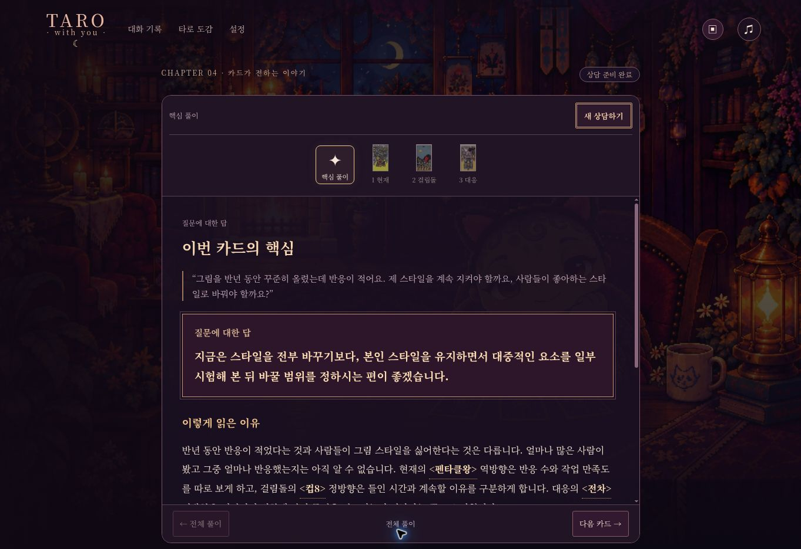

# 운영 검증

2026-10-07, production commit c778f52d8c8b1dd4efee0de77456233b4ee1d94f, deployment dpl_H4FqCBMF9hLCpj4qSqR9c14tgQQD. Production alias READY 확인.

실제 https://tarot-with-you.vercel.app/ 에서 새 상담 → 그림 스타일 질문 → 카드 세 장 선택 → 핵심 풀이 → 걸림돌 카드 상세까지 확인했다. 선택 카드는 펜타클 왕 역방향, 컵 8 정방향, 전차 역방향이다. 첫 답: “지금은 스타일을 전부 바꾸기보다, 본인 스타일을 유지하면서 대중적인 요소를 일부 시험해 본 뒤 바꿀 범위를 정하시는 편이 좋겠습니다.” 반응이 적다는 사실과 사람들이 스타일을 싫어한다는 추측을 구분했다. 카드 그림 설명과 질문 적용 본문이 분리되어 표시됐다.

운영 로그에서 reading version tarot-v13-evidence-and-reader를 확인했다. clarify 중 기존 snapshot 저장의 TAROT_STORE_BUSY 경고가 한 차례 있었으며, 내장 카드 자료로 상담과 풀이가 완료됐다. 원격 저장 안정성까지 무결하다고 주장하지 않는다. 긴 열 장 배열의 언어 오류 한 건은 final-review.md에 기록되어 있다.

